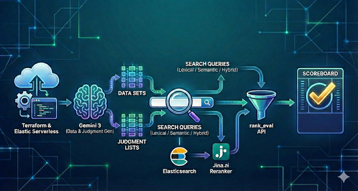
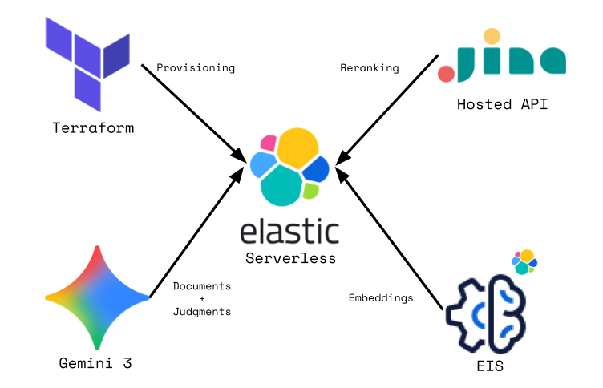
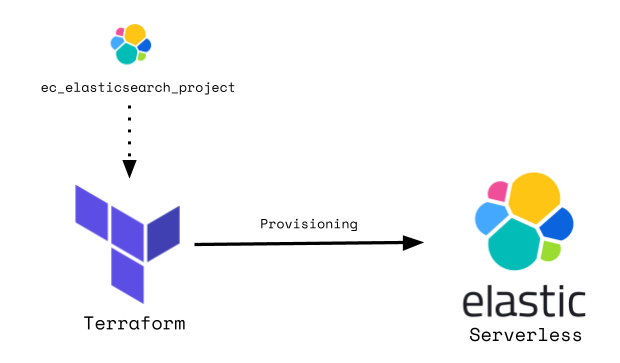
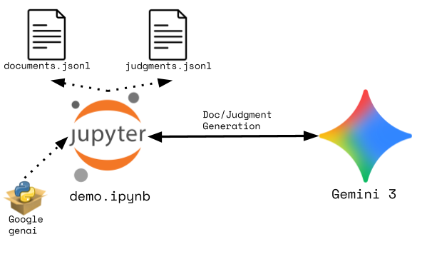
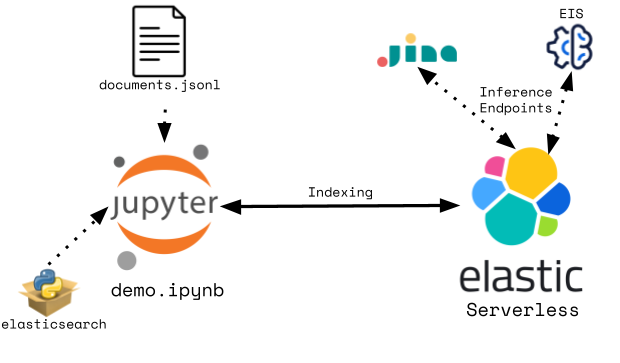
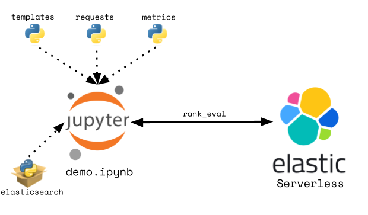

# Elastic Query Evaluation
The primary topic of this article is the evaluation of Elasticsearch query relevance.  I build out an Elastic serverless project, generate document and judgment sets via AI, and perform rank evaluation of various query types.  Topics covered:

- Provisioning of an [Elastic Serverless](https://www.elastic.co/cloud/serverless) project via [Terraform](https://developer.hashicorp.com/terraform)
- Synthetic generation of document and judgment sets via the [Google Gemini API](https://ai.google.dev/gemini-api/docs/gemini-3)
- GPU-accelerated embeddings via [ELSER](https://www.elastic.co/docs/explore-analyze/machine-learning/nlp/ml-nlp-elser) on [Elastic Inference Service](https://www.elastic.co/docs/explore-analyze/elastic-inference/eis)(EIS) 
- Creation of an [Elastic inference endpoint](https://www.elastic.co/docs/explore-analyze/elastic-inference/inference-api) for a [Jina.ai](https://jina.ai/) hosted reranker model.
- Use of the following Elastic retrievers:
  - [Standard](https://www.elastic.co/docs/reference/elasticsearch/rest-apis/retrievers/standard-retriever)
    - Lexical
    - Semantic via the [semantic_text](https://www.elastic.co/docs/solutions/search/semantic-search/semantic-search-semantic-text) field type
  - [Weighted RRF](https://www.elastic.co/docs/reference/elasticsearch/rest-apis/retrievers/rrf-retriever)
  - [Linear](https://www.elastic.co/docs/reference/elasticsearch/rest-apis/retrievers/linear-retriever)
  - [Rescorer](https://www.elastic.co/docs/reference/elasticsearch/rest-apis/retrievers/rescorer-retriever)
  - [Re-ranker](https://www.elastic.co/docs/reference/elasticsearch/rest-apis/retrievers/text-similarity-reranker-retriever)  
- Creation of [query evaluation templates](https://www.elastic.co/docs/reference/elasticsearch/rest-apis/search-rank-eval#template-based-ranking-evaluation)
- Use of the built-in Elastic relevance measurement API - [rank_eval](https://www.elastic.co/docs/api/doc/elasticsearch/operation/operation-rank-eval)


# Architecture
 

Elastic Serverless is used as the search core here.  Terraform provides build/tear-down of a Serverless project.  Gemini is leveraged to generate document and judgment sets that will ultimately be used for relevance comparisons.  ELSER on EIS provides the embeddings for semantic search.  Jina.ai's hosted reranker is used for the rerank query example.

# Provisioning


I use Terraform for cloud provisioning of an Elastic Serverless project.
- [Elastic Serverless Search resource](https://registry.terraform.io/providers/elastic/ec/latest/docs/resources/elasticsearch_project)
- [Elastic Stack provider](https://registry.terraform.io/providers/elastic/elasticstack/latest/docs/guides/elasticstack-and-cloud)

```hcl
terraform {
  required_version = ">= 1.0"
  
  required_providers {
    elasticstack = {
      source  = "elastic/elasticstack"
      version = "~>0.12"
    }

    ec = {
      source  = "elastic/ec"
      version = "~> 0.12"
    }
  }
}

provider "ec" {
  apikey = var.elastic_cloud_api_key
}

resource "ec_elasticsearch_project" "demo_project" {
  region_id     = var.region
  name          = "demo_project"
  optimized_for = "general_purpose"
  search_lake = {
    search_power = 2000
  }
}

provider "elasticstack" {
  elasticsearch {
    endpoints = ["${ec_elasticsearch_project.demo_project.endpoints.elasticsearch}"]
    username  = ec_elasticsearch_project.demo_project.credentials.username
    password  = ec_elasticsearch_project.demo_project.credentials.password
  }
  alias = "demo_project"
}
```

# Document + Judgment Generation


Document/judgement generation is driven out of the Jupyter notebook through use of the Google GenAI python module.  I've included several term sets across different domains that are fed via prompt to Gemini 3.  I give Gemini detailed instructions how the document and judgement JSON objects should be structured.  I then write those to file so that they can be reused allowing to Gemini to be by-passed for subsequent executions of the notebook.

- Term sets
```python
TERM_SETS = [
    ["algorithm", "data", "system", "network", "software", "hardware", "security", "optimization", "automation", "scalability", "performance", "integration"],
    ["patient", "treatment", "diagnosis", "clinical", "therapeutic", "medical", "healthcare", "wellness", "prevention", "symptoms", "recovery", "medicine"],
    ["investment", "portfolio", "returns", "risk", "capital", "market", "assets", "revenue", "profit", "liquidity", "valuation", "dividend"],
    ["learning", "students", "curriculum", "teaching", "assessment", "pedagogy", "education", "training", "skills", "knowledge", "academic", "instruction"],
    ["environmental", "sustainable", "renewable", "emissions", "conservation", "ecosystem", "climate", "green", "carbon", "pollution", "biodiversity"]
]
```
- Document Prompt
```python
    prompt = f"""
    - You are an expert JSON generator. Your task is to strictly adhere to the user's prompt and the provided JSON schema to generate a valid array of JSON objects.
    - Generate 100 unique JSON documents
    - The first 50 documents should utilize the following terms in a grammatically correct manner in the title and content fields: {term_set}
    - The remaining 50 documents should be on random topics.  Those topics could use some of the provided terms.
    - Each document should have a unique integer id starting from 1.
    - The title should be concise, between 5 to 10 words.
    - The content should be a detailed paragraph of at least 30 words.
    - Don't put any bolding, asterisks or quotation marks in the output.
    - Generate the documents such that there is a mix of relevance values when performing lexical or
    semantic search on them with the given terms.
    """
```

- Judgment Prompt
```python
    prompt = f"""
    You are an expert search relevance rater. Your task is to generate 1 search query
    and 20 relevance judgments from the provided documents based on that query.
    - The search query should be concise, between 3 to 7 words, and utilize some of the following terms: {term_set}.
    - These search query should be selected such that it has varying degrees of relevance to the 
    provided documents in both lexical and semantic terms.
    - The relevance judgments should be based on how relevant each document is to the query.
    - Relevance is rated on a scale from 1 (least relevant/match) to 5 (perfect match).
    - Consider both lexical and semantic relevance when rating the documents.
    - The index field should be the value 'test-index' for all judgments.
    - The id field should correspond to the document id being rated.

    **Documents to Rate Against:**
    {docs[0:50]}

    Generate the judgment list in the required JSON schema.
    """
```
# Indexing


I create a simple index schema on the generated documents.  I set the 'content' field up as a [multi-field](https://www.elastic.co/docs/reference/elasticsearch/mapping-reference/multi-fields) of text and semantic_text.  I specify the built-in inference endpoint for ELSER on EIS (GPU-accelerated).  I then use the Elastic Python client's [helper](https://elasticsearch-py.readthedocs.io/en/v8.2.2/helpers.html) lib to bulk load the 100 documents generated in the previous step.

```python
mappings = {
    "properties": {
        "title": {
            "type": "text",
            "fields": {
                "keyword": {
                    "type": "keyword"
                }
            }
        },
        "content": {
            "type": "text",
            "fields": {
                "embedding": {
                    "type": "semantic_text",
                    "inference_id": ".elser-2-elastic"
                }
            }
        }
    }
} 

es.options(ignore_status=[404]).indices.delete(index=INDEX_NAME)
es.indices.create(index=INDEX_NAME, body={"mappings": mappings})

def gen_data():
    with open("documents.jsonl", "r") as f:
        for line in f:    
            yield json.loads(line.strip())
            
result = bulk(client=es, index=INDEX_NAME, actions=gen_data())
print(result[0], "documents indexed")
```

# Evaluation


## Query Templates
I create a series of composable Python dictionaries that are then used build up increasingly complex query templates.  I create 5 templates:  Lexical, Semantic, Hybrid (weighted RRF), Hybrid (Linear Combination with Rescoring), and Hybrid (weighted RRF with [jina-reranker-v3](https://jina.ai/reranker/) reranking).  Those templates and the ratings from the generated judgment list are then referenced in rank_eval requests.  The Reranker query template is shown below:
```json
{
  "id": "rerank_query_template",
  "template": {
    "source": {
      "size": 10,
      "retriever": {
        "text_similarity_reranker": {
          "retriever": {
            "rrf": {
              "rank_window_size": 10,
              "retrievers": [
                {
                  "retriever": {
                    "standard": {
                      "query": {
                        "multi_match": {
                          "query": "{{query_string}}",
                          "fields": [
                            "title",
                            "content"
                          ]
                        }
                      }
                    }
                  },
                  "weight": 0.25
                },
                {
                  "retriever": {
                    "standard": {
                      "query": {
                        "match": {
                          "content.embedding": {
                            "query": "{{query_string}}"
                          }
                        }
                      }
                    }
                  },
                  "weight": 0.75
                }
              ]
            }
          },
          "field": "content",
          "inference_id": "jina-reranker-v3",
          "inference_text": "{{query_string}}"
        }
      }
    }
  }
}
```

## Execution
The rank_eval API allows sending multiple queries simultaneously and generating a given relevance [metric](https://www.elastic.co/docs/reference/elasticsearch/rest-apis/search-rank-eval#available-evaluation-metrics) for those queries.  Using the above-mentioned templates, requests, and ratings, I set up a loop to generate [NDCG](https://www.elastic.co/docs/reference/elasticsearch/rest-apis/search-rank-eval#_discounted_cumulative_gain_dcg) and [ERR](https://www.elastic.co/docs/reference/elasticsearch/rest-apis/search-rank-eval#_expected_reciprocal_rank_err) relevance metrics.
```python
for metric in metrics:
    metric_name = list(metric.keys())[0]
    eval = {
        "templates": templates,
        "requests": requests,
        "metric": metric
    }
    result = es.rank_eval(body=eval, index=INDEX_NAME)
    for query in result['details']:
        if metric_name not in results:
            results[metric_name] = {}
        results[metric_name][query] = result['details'][query]['metric_score']
```

## Results
Below are some sample results from the synthetic document + judgement sets included in this repo.


# Source
https://github.com/joeywhelan/es-rankeval